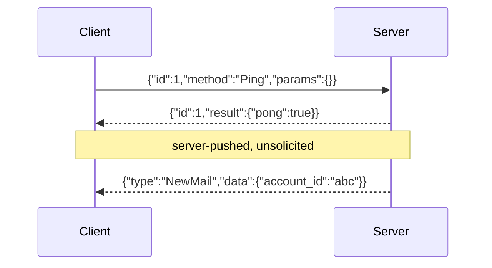
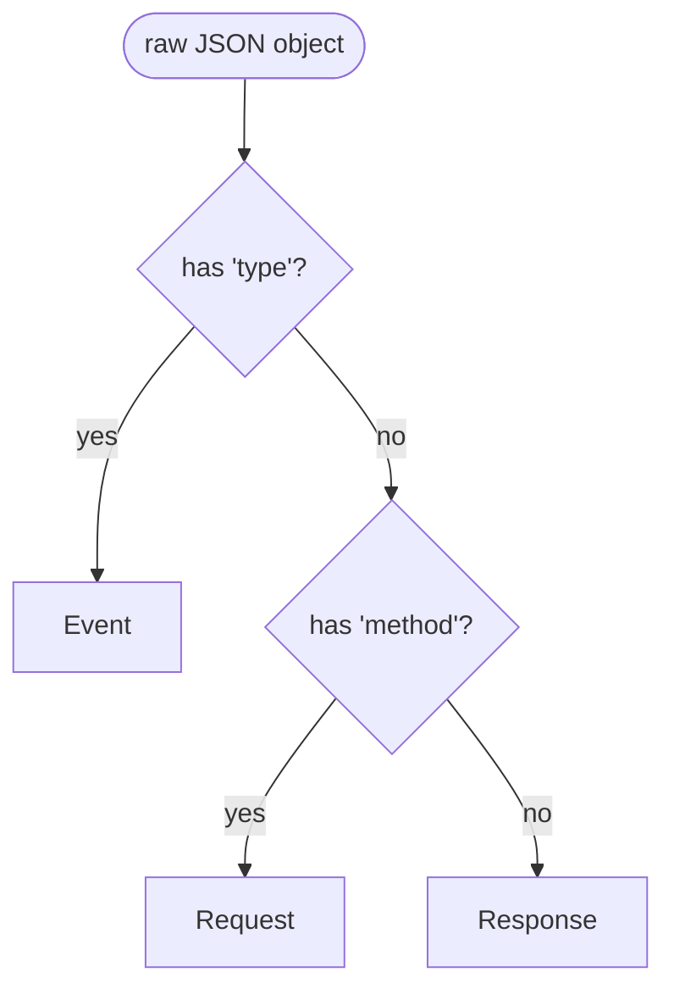

# Wire Protocol

The wire is newline-delimited JSON. Each message is one self-contained
JSON object terminated by `\n` (the JSON encoder appends it; the
decoder consumes it). No framing header, no length prefix, no batch
arrays.



## Message shapes

### Request

```
{"id": 1, "method": "Ping", "params": {...}}
```

| Field | Type | Notes |
|-------|------|-------|
| `id`     | uint64    | Required. Echoed in the Response. Caller-chosen. |
| `method` | string    | Required. The handler name registered on the server. |
| `params` | any JSON  | Optional. Passed to the handler as `json.RawMessage`. |

### Response

```
{"id": 1, "result": {...}}
{"id": 1, "error": {"code": -32601, "message": "method not found"}}
```

| Field | Type | Notes |
|-------|------|-------|
| `id`     | uint64    | Required. Matches the Request's `id`. |
| `result` | any JSON  | Present on success. Mutually exclusive with `error`. |
| `error`  | object    | Present on failure. `{code, message}`. |

### Event

```
{"type": "NewMail", "data": {"account_id": "abc"}}
```

| Field | Type | Notes |
|-------|------|-------|
| `type` | string  | Required. Event tag for client-side switch. |
| `data` | any JSON| Optional. Passed to the client as `json.RawMessage`. |

## Discriminator

`DecodeMessage` reads the message and looks at the **top-level keys
only**:



1. If `type` is present → it's an Event.
2. Else if `method` is present → it's a Request.
3. Else → it's a Response.

This means a Request **must not** include `type`, and an Event **must
not** include `method`. The library enforces this on encode by using
dedicated struct types.

## Why newline-delimited JSON?

- **Debuggable.** `socat - UNIX-CONNECT:.../app.sock` gives an
  interactive REPL. Paste a JSON line, get a JSON line.
- **Streaming.** A single TCP-ish stream carries unbounded messages
  without a length field — `json.Decoder` parses one object at a
  time. Server push (Events) costs no protocol gymnastics.
- **Language-agnostic.** Bridging from Python, Node, Rust is one
  socket open + a JSON encoder.
- **No codegen.** Adding a method is one `s.Handle("Foo", fn)` call.

## Why not JSON-RPC 2.0 strictly?

JSON-RPC 2.0 requires a `"jsonrpc": "2.0"` field on every message and
distinguishes "notifications" (no id) from "requests" (with id). For a
local daemon, the version preamble is pure overhead, and the
notification distinction collapses naturally into Event-vs-Request.

We borrow the **error code numbers** so any JSON-RPC 2.0 client
library recognizes `-32601` as "method not found", but the rest of the
shape is leaner.

## Security model

The socket is created with `0700` permissions inside a per-user
runtime directory. The only authorization is filesystem permissions:
**any process running as the same user** can connect.

This is appropriate for "background helper for the current user"
daemons. It is **not** appropriate for:

- Multi-user shared sockets (use OS-level credentials check, e.g. SCM_CREDENTIALS).
- Network-exposed daemons (don't — use TLS + a real RPC).
- Privilege boundaries (don't run the daemon as root with a 0700 socket and expect clients in another UID to be safely denied if they happen to share the FS).

> [!CAUTION]
> Do not `chmod 0777` the socket "for convenience." That is equivalent
> to running an unauthenticated RPC server on localhost.
